# 🎵 Agrupamento de Músicas por Similaridade Sonora (K-Means e Hierarchical Clustering)

## 🔍 Problema

Agrupar músicas por **características de áudio** (ex: ritmo, energia, valência, dançabilidade) para identificar similaridades sonoras e simular um sistema de recomendação musical.

---

## 🧠 Técnicas Utilizadas

- **K-Means:** agrupa músicas com base em atributos contínuos, encontrando padrões de similaridade.
- **Hierarchical Clustering (Ward):** permite visualizar a hierarquia de semelhanças entre músicas por meio de um dendrograma.

---

## 📊 Conjunto de Dados

**Fonte:** [Kaggle - Spotify Song Attributes Dataset](https://www.kaggle.com/datasets/geomack/spotifyclassification)  
**Arquivo utilizado:** `data_traduzido.csv`

**Principais variáveis:**
- `energia`, `dançabilidade`, `valência`, `acusticidade`, `instrumentalidade`, `vivacidade`, `volume`, `tempo_bpm`, `duração_ms`, etc.

---

## 🧰 Processo de ETL e Limpeza

1. **Importação** dos dados (`pandas`, `numpy`);
2. **Remoção** de duplicatas e valores ausentes;
3. **Seleção** das colunas numéricas relevantes para agrupamento;
4. **Padronização** com `StandardScaler` para uniformizar escalas;
5. **Redução dimensional** (PCA) para visualização em 2D.

---

## 📈 Visualizações

- **Elbow Method (inertia):** define o número ideal de clusters (`k`);
- **Silhouette Score:** avalia a coesão e separação dos grupos;
- **Scatter Plot (PCA):** mostra a distribuição dos clusters formados;
- **Boxplots por feature:** evidenciam a variação de cada atributo em cada cluster;
- **Dendrograma (Hierarchical):** representa visualmente a relação entre músicas.

---

## 📉 Interpretação dos Resultados

- Cada **cluster** representa um grupo de músicas com perfis sonoros semelhantes;
- Clusters podem indicar:
  - 🎤 **Alta energia + alta dançabilidade:** músicas animadas, estilo pop/eletrônico;
  - 🎻 **Alta acusticidade + baixa energia:** músicas calmas, acústicas;
  - 🎧 **Alta instrumentalidade:** faixas sem vocais;
- Métrica **Silhouette** avalia o quão distintos estão os clusters;
- Resultados auxiliam na criação de sistemas de recomendação baseados em similaridade sonora.

---

## 🚀 Como Executar

1. Instale as dependências:
   ```bash
   pip install -r requirements.txt

2. Coloque o arquivo data_traduzido.csv na mesma pasta do script principal.

3. Execute o código:
    ```
    python main.py

4. Observe:
- Gráficos de Elbow, Silhouette e PCA;
- Boxplots e Dendrograma;
- Tabelas com centros/médias dos clusters.

---

## 📚 Resultados Esperados

O código gera:

- Gráficos de agrupamento e hierarquia de similaridade;
- Tabelas com médias de atributos por cluster (em escala original);
- Relatórios comparativos de desempenho entre K-Means e Hierarchical Clustering.

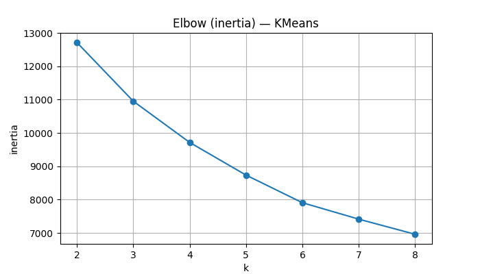 
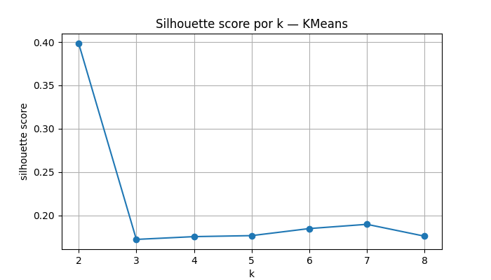 
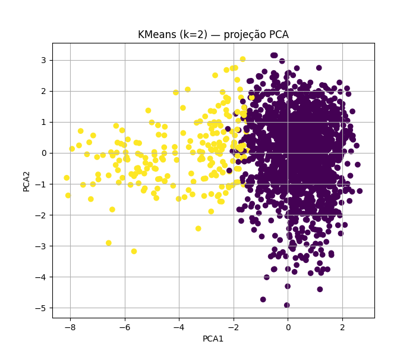
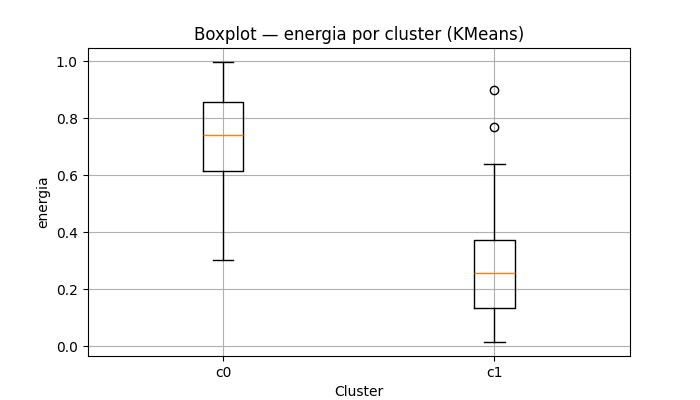
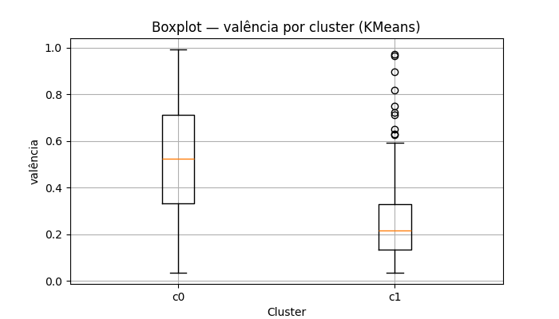
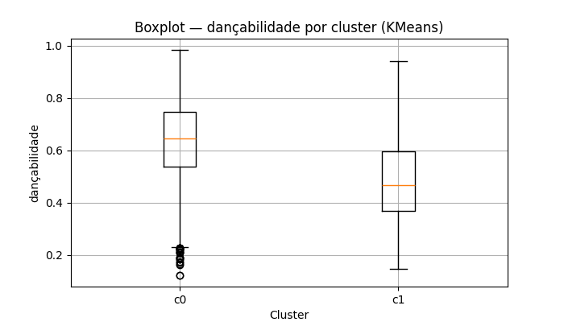
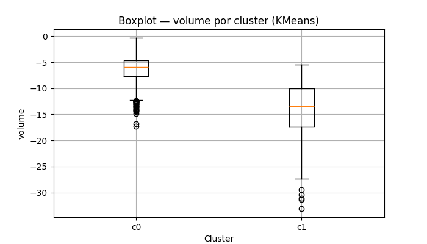
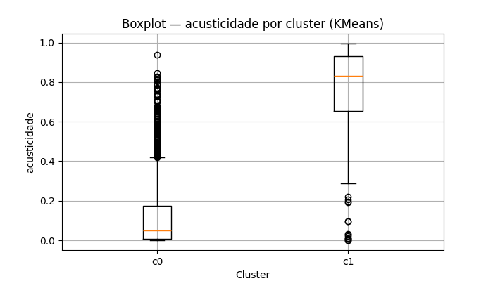
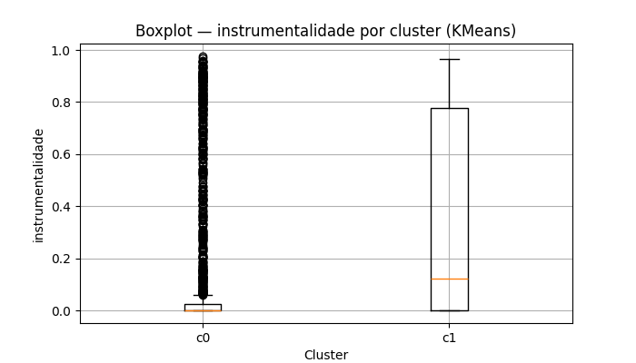
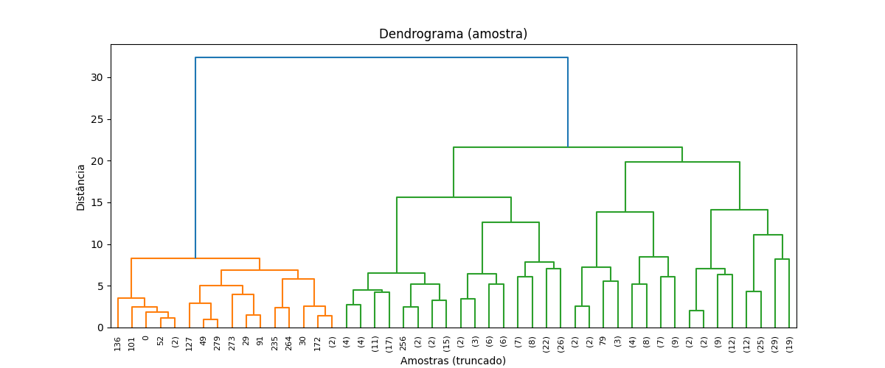
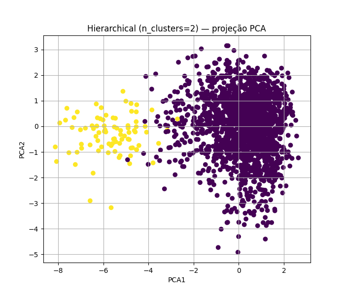

---

## 📅 Objetivo:
Explorar técnicas não supervisionadas de Machine Learning para análise de padrões sonoros e recomendação musical automática.

---

## 💡 Aluna:
### Beatriz da Costa Lauro — 6° Período — Universidade do Estado de Minas Gerais (UEMG)

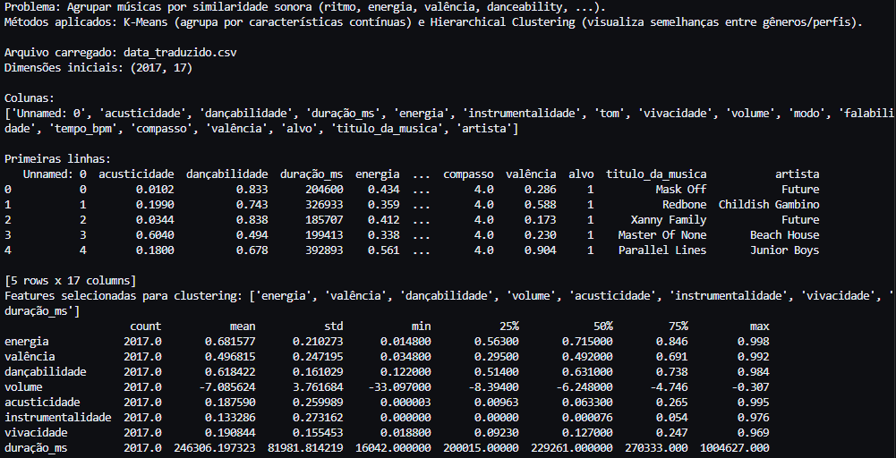
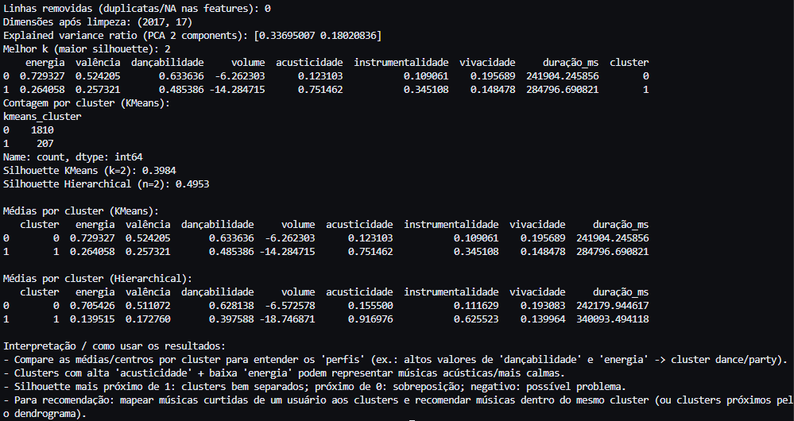